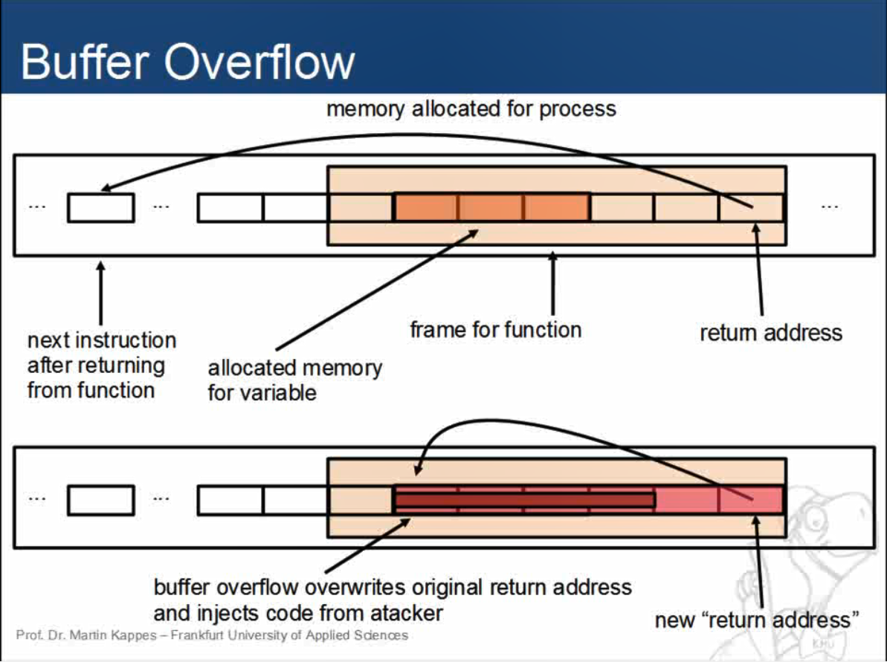
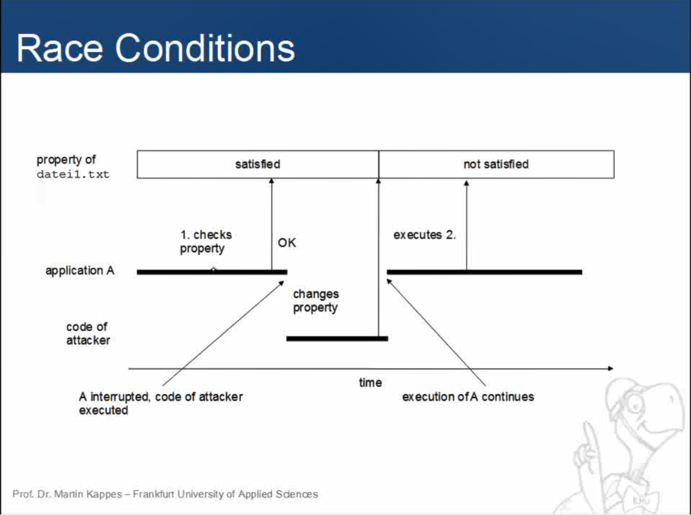
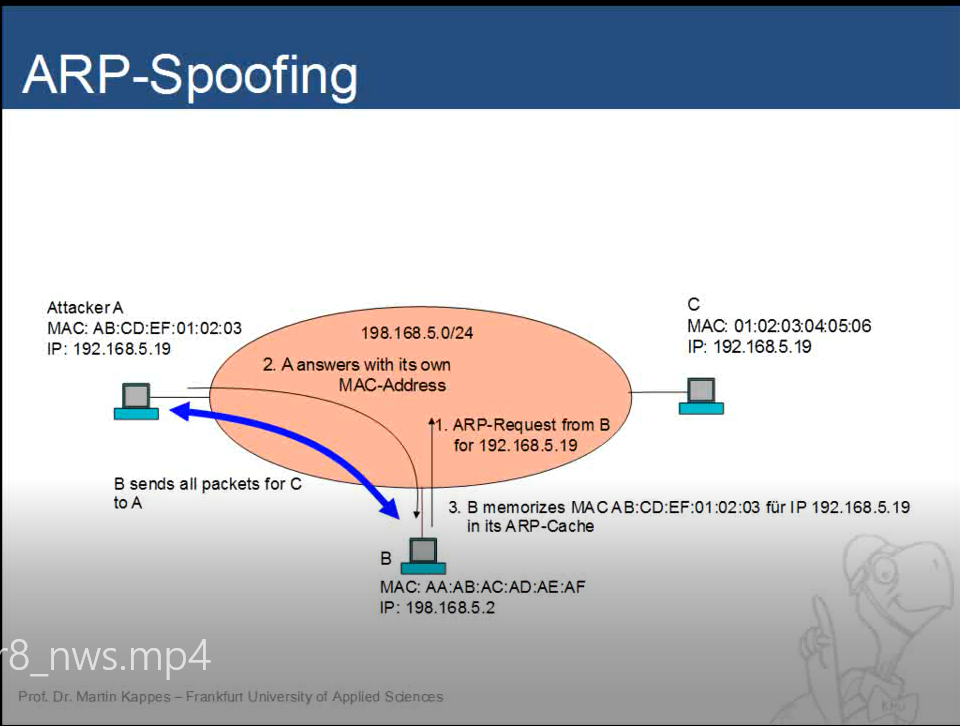
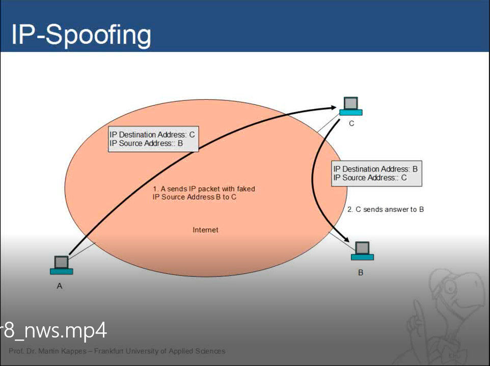
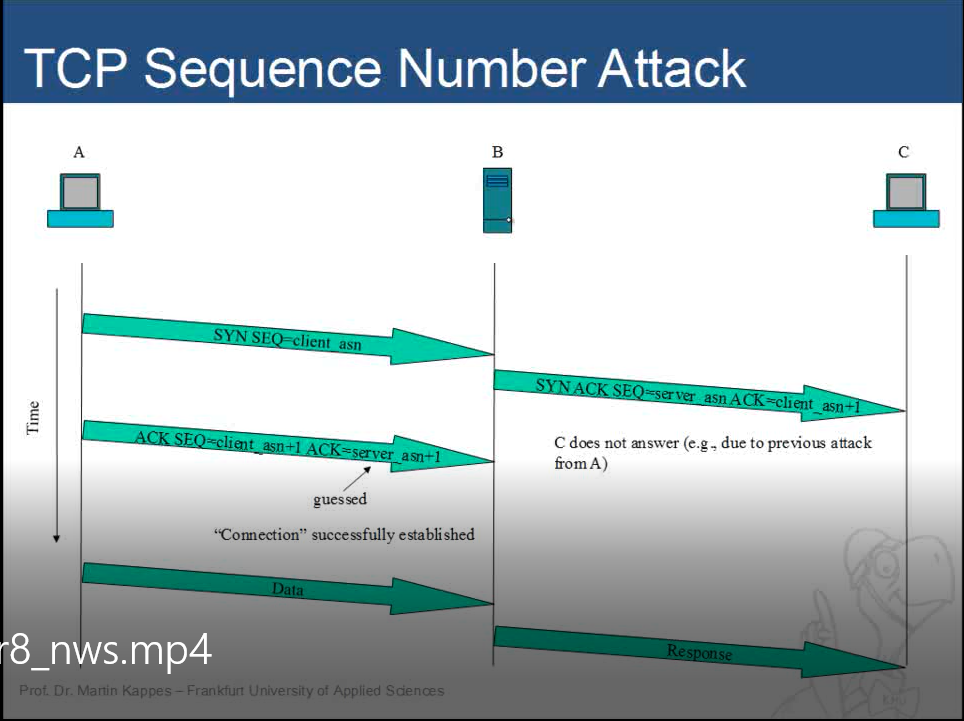
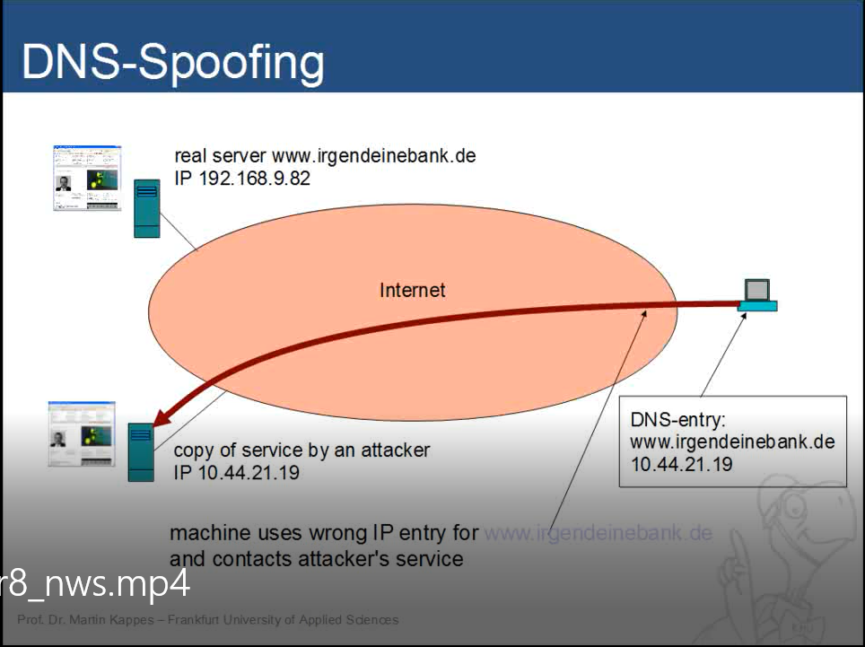

<h1> IT Security </h1>

*Here are the list of information that need to be composed* 

# Lec1
## Introduction

   * **What is the term of security?**
           * Protection of information and information systems against `unauthorized access` and `modification` and `availability` of information system services for `legitimate users`, including measures to thwart, discover or log threats. Protection against unauthorized access must be ensured during `storage`,` processing` or `in transit`
* **What is the aim of security? Example**
    * Confidentiality: Against unauthorized access
    * Integrity: Against unauthorized modification
    * Availability: Resources and services are available for legit users
    * Authenticity and authentication:  Explicit identification of the sender of info or a communication peer
* **What are passive and active attack?Why those need to be distinct**
     * Passive
          * Attacker doesn't actively participate
          * Difficult to discover
          * Preventive means of protection against active attacks (?)
     * Active
          * Attacker actively participate
          * Manipulate data or systems
          * Attacker often leaves traces
          * Prevention and Detection is possible
     * Why distinct these 2 type of attack? **not sure**
          * Because each of these attack focus on different basis, perform diff task, cause different type of damage and and focus on different IT-Security aim. => need to differentiate to have suitable method to prevent those attack
* **Explain security processes and its phases** (not sure)
     * Plan: Establish `objectives and processes` required to deliver the `desired results`.
     * Do: The do phase allows the `plan` from the previous step `to be done`. `Small changes` are usually `tested`, and data is gathered to see `how effective` the change is.
     * Check: During the check phase, the `data and results` gathered from the do phase are `evaluated`. Data are `compared to the expected outcomes` to see any  similarities and differences. The testing process is also evaluated to see `if there were any changes from the original` test created during the planning phase. To see `what changes work better` than others, and if said changes  can be `improved` as well.
     * Act: This act phase is where a `process is improved`.  Records from the "do" and "check" phases help `identify issues` with the  process. These issues may include problems, non-conformities,  opportunities for improvement, inefficiencies and other issues that result in outcomes that are evidently less-than-optimal. Root `causes of  such issues are investigated`, `found and eliminated` by modifying the  process. Risk is `re-evaluated`. At the end of the actions in this phase,  the `process has better instructions, standards or goals`. `Planning for  the next cycle` can proceed with a `better base-line`. Work in the `next do phase` should `not create recurrence` of the identified issues; if it does, then the action was not effective.
* **Difference between nonrepudiation and authenticity**
  * Authentication verifies who you are (User-ID) while Non-Repudiation verifies what you did (e.g Sending a message).
  * Authenticity is about one party (say, Alice) interacting with another (Bob) to convince Bob that some data really comes from Alice.
  * Non-repudiation is about Alice showing to Bob a proof that some data really comes from Alice, such that not only Bob is convinced, but Bob also gets the assurance that he could show the same proof to Charlie, and Charlie would be convinced, too, even if Charlie does not trust Bob.

# Lec2
## Cryptography

   * **Model of a cryptographic system**
* **Classical encryption methods?**
* **What are Encryption schemes?**

   * **Differences between public key and symmetric encryption schemes and their respective adv and disadvantage**
* **Term of Hybrid encryption scheme and its sequence thereof**
* **Term of "Mode of operation". Outline enrypt and decrypt for at least 2 different modes**
* **Conditions must be met to conduct brute force attack**
  * Length of cipher must longer than key and key must be finite number of bit
* **What is One time pad? and why it is unbreakable if the encryption key is unknow**
  * Use randomness to generate key, and encrypt the message with that random key, so it is uniform distribution
* **How Electonic Code Book (ECB) work. Its adv and disadv? When this method can be use **
* **How Cipher Block Chaining,Cipher Feedback Mode, Output Feedback Mode, Counter Mode work? **

# Lec3
## Authentication

    * **Term of "Authentication" and "Authencity". Factors for it? What is two-factor-authentication**
        	* Authencity: The quality of being genuine or not corrupted from the original. 
	* Authentication: something which validates or confirms the authenticity of something 
	* What you know (Password), What you have (Token), What you are (Biometry)
	* 2-Factor-authentication: provide multiple proof of your identification to get the permission to access.
   * **Name and explain on which points the security of password-based authentication schemes depends.**
* **How secure password should be chosen?**
* **Describe the sequence in a password-based challenge-response authentication and compare its security with sending the password directly either encrypted or unencrypted.**
* **Describe the terms Token, Smart Card and Biometry and explain their use for authentication**
* **Describe Cryptographic Hash Functions**
  * Compute characteristic pattern (“fingerprint”) of fixed length for each message. Mostly 128 or 256 bits. It should be impossible to find a message producing a given hash value, to find two messages with the same hash value. Widely used algorithms: MD5 and SHA
* **Describe how public key or symmetric cryptography can be used for authentication.**
* **Describe what a digital signature is and how it operates. Also describe how hash functions are used in digital signatures.**
* **Explain in detail format, composition and use of certificates. Also describe Certificate Authorities, Root-CA and Certificate revocation.**
* **Discuss advantages and disadvantages of using cerfiticates and CAs.**

# Lec4
## Operating System Security (this lesson exercise file hasn't covered all the topic in the lecture)

   * **Main tasks of an Operating System and how do they relate to security**
* **Explain how the access control mechanisms implemented by an Operating System can be circumventde by an attacker and in which cases it can be enforced**
* **Explain Linux's access control mechanism in detail**
* **Explain each of the field in ls-l command's return**
* **Which permissions are sufficient to execute a file containing a binary? Which permissions are sufficient to execute a shell script?**
* **Which permissions are needed to copy a file?**
* **Which permissions are necessary to move a file?**
* **`setfacl` `geftacl` do and explain their practical use in a self-chosen example. What chances do the use of ACLs imply for the commands ls, cp and mv?**

# Lec5
## Applications (this lecture dont have exercise)
* **Buffer overflow?**
	
	* Buffer overflow is a vulnerability within the system. with buffer overflow the attacker can inject his own code into the system and execute it. The attacker can gain administrative right to the machine.
	* Applications are executed from assembler code. These programs are not developed in assembler codes but c/c++,... and then are run to a compiler that translate them into assembly language.
	* Resources and memory are allocated for the program. For every function in a program, there is a data frame for the function (include data 4 the function and the address 4 the next function is stored. Because of Von Neumann arch, data and program code are held in the same memory = computer does not distinguish between data and program.
	* Frame for variables are fixed in size, and the program expects inputs, incase the inputs are larger than the memory allocated 4 it, the program might not check for the input is within the boundary or not, which will overflow over to other cells.
	* Results in a change in the return address (overwritten, manipulated) to the inputs and the attacker code gets injected.
	* Not very difficult to protect against bufferoverflow: 
		* Need to check the input does not overflow the expected input.
		* Canaries, a random value b4 return address, which is also stored elsewhere. The value is later checked.
* **Race conditions?**
		
	* Many processes run in parallel on an OS (either in parallel or switching back and forth)
	* Having multiple processes can interupt each other.
	* Application A is running and needs to check for a property 
	* A parallel code of attacker is executed and interupt app A. Which changes the properties that A needed to check.
	* When the execution of A continues, the properties is already manipulated. 
	* Also known as(Race condtions, TOC time of check, TOU time of use error)
	* Can use semaphores or other atoma instructions for the machine for when executions are not interuptable.
* **Active content?**
	* Downloaded file can have malware or undesired functionality. 
	* Can use cryptographic mechanisms to ensure safety (certificates). The program might still contains parts that the issuer is not awared about.

	* Active content: code that you download over the internet, but instead of installing but directly run it e.g: javascript. 
	* Java and java applets: 
		* Java is an interpreter language, it compile codes into java byte code. which is run in java virtual machine. Since virtual machine is an abstract interface, there are libraries. The virtual machines can take on a lot of security functionalities and restrict what the byte code is allowed to do.
		* That is particularly done 4 java applets, which are downloaded from the internet and executed on the local machine.
		* Many think because of this applets are safe, no. There are signed and unsigned applets. Applets can have access to system files. Appplets are also not allowed to open network connections except for where it is downloaded from. Trusted applets are allowed to read and write in system files, but only if they are allowed. 
		* Applets in the past have been compromised. But using applet is safer than running java directly.
	* Also javascript, ActiveX (Microsoft windows)
​    
# Lec8
## Network security

* **Depict potential threats when communicating over a network.**
	* Intercept the traffic between the sender and the receiver, gains access to the info between the two
	* Manipulate: whatever the sender is sending to the receiver, the communication could be changed, altered
	* Spoof: Impersonate the sender, the receiver cannot distinguish between the sender and unauthorized third party
	* Disruption: If you cannot hack it break it. The unauthorizeed third party can disrupt communications.

* **Explain why an attacker might manipulate routing in a network**

attacks are especially simple when the attacker has access to one of the intermediate
stations which relays the communication between the receiver and the receiver. Many of
the attack are based on routing the routing the traffic over a station that is under control of
the attacker.
The structure of the internet makes it simple to do so.
* **Explain the following attacks:**
     * **MAC Address Spoofing**
	 
MAC Spoofing: Not too diffucult to change MAC address. Certain app use
the MAC for authentication purposes, like DHCP, WLAN use mac for restricting network access,...

	* **ARP Spoofing**
		
		* ARP Spoofing: Address resolution protocol for translating IP to MAC such that within the same LAN segment packets can be routed.
		* If such a translation is necessary, then the protocol will findout whether a MAC address will belong to an IP address.
		* Since you don't want to this all the time so you store it in the ARP cache.
		* Attacker poison/manipulate the ARP cache to their advantage
		* B wants to send packets to C (192.168.5.19)
		* A reply to B that the MAC address for 192.168.5.19 is A's MAC.
		* If A makes sure that C is not listening and responding to B, B will store A's MAC address as the MAC for 192.168.5.19 in its ARP cache.
		* Later on all B packets intended for C will be send to A. 
		* It is a well-known attack.

		* How to prevent: 
			* Have a static arp cache or check regularly whether a machine's arp cache is the same as the others arp cache and is matching with their own IP.
			* Machine can also do ARP queries on its own IP addresses and find out whether somebody else is alreadying responding to this.

	* **IP Spoofing**
		

Impersonate an IP address. A impersonates B's IP and send a message to C, C then answers to B without knowing
about A. B is going to see traffic from C. = ddos attack. A wil not get much of a respond.

	* **TCP Sequence Number Attack**
		
		* A impersonates C in a 3 way handshake. A (impersonating C) sends SYN to server B
		* B then responds by sending a SYN ACK with sequence number = server to C.
		* C for some reasons does not respond to B (Due to previous attack by A).
		* A then guesses the server sequence number and +1 to it as ACK for the ACK respond and SEQ = client number +1 (previously created by A).
		* A successful connection is establish between A and B if A sucessfully guessed the sequence number.
		* There were a vulnerability to guess a sequence number. 
		* In the past there were trust relationships between machines (no cryptographic...). A could use this to add its IP to B's trust relationships, close the connection and uses the trusted relationship.

     * **Phishing**
	 
Attacker run a service that looks like the bank's service (not the actual bank), someone who connect to this service, all entered credentials are 
exposed to the attacker. Ways to lure the client to connect to the fake service. Two of them are phishing and pharming. For phishing the client will 
receive an email, from seemingly the bank, but it is actually from the attacker. Within that email embedded is the link, but the dns name of the bank is not
included but the link is somehow similar to the bank's. 

     * **Pharming / DNS Spoofing**
	 	
For pharming, the attacker manipulate/poison the dns service protocol. There are vulnerability of the system that can be misused by the attacker. The attacker can
manipulate the dns server or the machine (but they rather do the machine). So the dns domain would lead the client to the attacker's IP website.

* **Advantages and disadvantages of security mechanisms and protocols on all layers of the network reference model and compare them. Also, give examples for their use.**
	* Application layer security: The application programmer has to take care of all of the security needs of the application (CIA).
		* Advantages: Allow to use networks which are completely unsafe, independent of mechanisms of other layers, the protection is truly between the sender and the receiver (end to end).
		* Disadavantages: Complexity of application increases, It is difficult to reuse components within the applications, each and every software may have its own mechanism in the worst case.
		* Examples: Email encryption by the use of certificates, If the user would encrypt a file b4 the file is transmitted.
	* Transport layer security: The unencrypted data is handed over from the application layer to the transport layer, the transport layer transmit the encrypted data is transmitted throug the network, and is decrypted again in the transport layer.
		* Advantages: Allows transport layer does these things without application layer knowing it in some cases, mechanism which is implemented once can be use by as many applications that like to use it (good reusability)
		* Disadvantages: Not end to end (In case there is/are a server/s that relays information in the middle), we cannot make sure that the whole transport is encrypted, also the data is unencrypted in the middle server.
	* Network layer security: Secure communication between 2 intermidiate stations on the network layer between 2 routers or a router and an endpoint (not end to end), transparent to the above layers.
		* Advantages: High flexibility (possible to provide security on parts of the communication flow), transparency to the above layers (no changes to above layers to deploy these mechanisms).
		* Disadvantages: Transparancy is also bad because it is impossible or very difficult to intentionally employ these mechanisms.
		* Examples: Virtual network machine
	* Data link layer security: Authentication, authorization and access control
		* Advantage: Allow to control which station are granted access to the Data link layer within the network
		* Disadvantage: solely local protection
		* Examples: Security in wireless LAN, ....
# Lec9
## Firewalls

   * **Firewalls ? Packet filter ? application level gateway ?demilitarized zone? tunnel**
* **How packet filter works**
* **Network Address Translation is and how it works.**
* **inherent weaknesses and vulnerabilities in the concept Firewalls**
* **Describe how a static packet filter distinguishes between incoming and outgoing TCP connections. Denote the corresponding rules in pseudo notation or verbally.**
* **Describe how a dynamic packet filter distinguishes between incoming and outgoing TCP-connections. Denote the corresponding rules in pseudo notation or verbally.**

# Lec10
## Virtual Private Networks

   * **VPN? RAS? Site-to-site VPN?**
   * **How IPSec works in detail. In your explanation, the terms AH, ESP, Tunnel Mode and Transport mode should be addressed. Also, describe what the Sequence Number in AH and ESP is used for.**

        * **Explain and describe how OpenVPN works in detail. In your explanation, the terms tun device and tap-device should be addressed.**
    ## Lec13
    # Network Applications (this lecture dont have file exercise)

   * **How emails work?**
* **POP-Auth?**
* **App layer encryption**
* **SSH**
* **Local PFW**
* **Remote PFW**
* **TLS/SSL**
* **Dynamic content**
* **Simple Anonymization**

